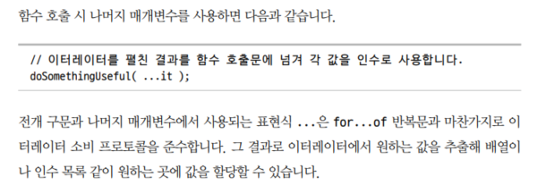

# 3장

## 3.1 이터레이션 패턴

데이터를 처리하는 패턴은 전체 가독성에 영향을 줌

> 이터레이션 패턴은 **데이터를 일정 단위로 쪼개고**, 각 조각을 **차례대로 순회**하며 점진적으로 처리하면 좀 더 범용적이고 유용할거라는 아이디어에서 시작되었다.

`next()`메서드는 **이터레이터 리절트**라 불리는 객체를 반환하며 해당 객체에는 `value`와 `done`이라는 프로퍼티가 있어야 한다.

> 반복 작업이 끝나지 않은 경우 `done=false`이다.

### 3.1.1 이터레이터 소비하기

#### `for ... of`를 통한 소비

```js
var it = ...;

for (let val of it) {
    console.log(`이터레이터 값: ${val}`)
}
```

#### 스프레드 연산자(`...`)와 `rest` 매개변수를 통한 소비

`...`가 이터레이터 소비자이다.

**스프레드 연산자**

```js
const it = [...arr1, ...arr2]; // ...가 arr1과 arr2의 이터레이터 객체를 얻고 next()를 순회하며 value를 추출함

const args = [5, 6];
Math.max(...args); // ...가 args의 이터레이터를 소비하여 개별 인자를 추출하여 전달함 -> 얘는 나머지 매개변수가 아니라 스프레드 연산자에 해당하는 듯
```

**rest 매개변수**



> ⚠️ 책에서 "나머지 매개변수"라고 설명한 doSomethingUseful(...it)는 실제로는 **전개 구문(Spread Syntax)**이다. 나머지 매개변수는 함수 정의에서만 사용되며, 이터레이터 프로토콜을 사용하지 않는다.

-   이걸 왜 나머지 매개변수라고 설명했을까?
-   [나머지 매개변수와 전개 구문](https://ko.javascript.info/rest-parameters-spread)
    -   읽어봐도 나머지 매개변수는 함수를 정의할 때 쓰는 것임

```js
function sumAll(...args) {
    // 이게 나머지 매개변수
    //남아있는 매개변수들을 args에 모아 넣으라는 의미
    // args는 배열의 이름
    let sum = 0;

    for (let arg of args) sum += arg;

    return sum;
}
```

> 제미나이와 클로드 모두 **나머지 매개변수**에서 사용되는 `...`는 이터레이터 소비 프로토콜을 준수하지 않는다고 말하고 있음.

### 3.1.2 이터러블

-   **이터러블(Iterable)**: 이터레이터를 리턴하는 `Symbol.iterator` 메서드를 가진 객체
-   **이터레이터(Iterator)**: `{value : 값 , done : true/false}` 형태의 이터레이터 객체를 리턴하는 `next()` 메서드를 가진 객체.`[Symbol.iterator]()안에 정의됨`
-   **이터레이션(Iteration)**: 순회 작업 자체
-

[iterable 객체](https://ko.javascript.info/iterable)
[이터러블, 이터레이터](https://inpa.tistory.com/entry/JS-%F0%9F%93%9A-%EC%9D%B4%ED%84%B0%EB%9F%AC%EB%B8%94-%EC%9D%B4%ED%84%B0%EB%A0%88%EC%9D%B4%ED%84%B0-%F0%9F%92%AF%EC%99%84%EB%B2%BD-%EC%9D%B4%ED%95%B4)

반복가능한 객체, 문자열, 배열, 맵, 셋등의 자료구조나 컬렉션이 모두 이터러블의 예이다.

-   이터러블 객체는 `for .. of`를 쓸 수 있는 객체이고
-   유사 배열 객체는 `length` 프로퍼티가 있는 객체이다
-   이터러블 객체에만 포함될 수도 있고, 이터러블이며 유사 배열 객체일 수도 있고,유사 배열 객체에만 포함될 수도 있는 것임

#### 직접 만들어본 이터러블

```js
/* 이터러블 객체 */
let range = {
    // 1) 객체 생성
    from: 1,
    to: 5,
};

range[Symbol.iterator] = function () {
    // 2) 새로운 키:밸류 를 추가한다. 키는 변수 형태, 밸류는 함수이다.

    /* 이터레이터 객체 */
    return {
        // 객체를 리턴한다.
        current: this.from,
        last: this.to,

        next() {
            // 3) next() 정의
            if (this.current <= this.last) {
                return { done: false, value: this.current++ };
                // 4) {value : 값 , done : true/false} 형태의 이터레이터 객체를 리턴
            } else {
                return { done: true };
            }
        },
    };
};

for (let num of range) {
    alert(num); // 1, 2, 3, 4, 5
}
```

-   `for .. of`가 시작되면, `for .. of`는 `Symbol.iterator`를 호출한다.
-   `for .. of`는 반환된 객체(이터레이터)만을 대상으로 동작한다.
-   `for .. of` 다음 값이 필요하면 `for .. of`는 이터레이터의 `next()`메서드를 호출한다.
-   `done = true`는 반복이 종료되었음을 의미한다. `done = false`일땐 value에 다음 값이 저장된다.

#### 맵 자료구조의 이터레이터

```js
var buttonNames = new Map();
buttonNames.set(btn1, '버튼 1');
buttonNames.set(btn2, '버튼 2');

for(let [btn, btnName] of buttonNames){
    ...
}

for(let btnName of buttonNames.values()){
    ...
}
```

#### 배열의 인덱스와 값 순회

```js
var arr =[1, 2, 3]
for(let [idx, val] of arr.entries()){
    ...
}
```

> JS의 내장 이터러블은 키만 대상으로 하는 `keys()`와 값만 대상으로 하는 `values()`, 키와 값을 대상으로 하는 `entries()`메서드를 제공한다.

---

## 3.2 클로저

> 클로저: 함수가 정의된 스코프가 아닌 다른 스코프에서 함수가 실행되더라도 스코프 밖에 있는 변수를 기억하고 이 외부 변수에 계속 접근할 수 있는 경우

### 클로저의 특징

-   함수는 자연스럽게 클로저가 된다.
-   클로저를 직접 보고 싶으면 함수가 정의된 스코프가 아닌 다른 스코프에서 실행해야 한다.

### 클로저 예시 코드

```js
function greeting(msg) {
    return function who(name) {
        // who는 클로저
        console.log(`${name} 님, ${msg} !`);
    };
}
var hello = greeting('안녕하세요');
```

-   `greeting()`의 실행이 종료되면서 내부 함수 `who()`를 반환하는데, `who`에서는 `msg`를 사용하기 때문에, JS 엔진은 가비지 컬렉션(GC)의 대상에서 제외한다.

## 3.3 this 키워드

> **함수의 실행**과 관련있는 키워드

-   `this`는 함수의 정의에 종속되어 결정되는 변치 않는 정적 특성이 아니라, <ins>함수를 호출할 때마다 결정되는 **동적인 특성**</ins>이다.

### this와 실행 컨텍스트의 작동 방식

```js
const assignment = classroom('카일');

// 1. 컨텍스트 없이 호출
assignment();
// this = ??? (undefined 또는 window)

// 2. homework라는 컨텍스트를 지정해서 호출
homework.assignment();
// this = homework
```

> 함수에서 `this`를 사용하면 컨텍스트를 동적으로 지정할 수 있고, 다른 객체에도 함수를 재사용할 수 있어 매우 유연함

---

## 3.4 프로토타입

> **객체 프로퍼티 접근**과 관련있는 키워드

프로토타입은 두 객체를 연결하는 연결 장치이다.

-   객체가 생성될 때 만들어진다.
-   프로토타입을 통해 새롭게 생성된 객체는 기존에 존재하던 다른 객체와 연결된다.
-   프로토타입을 통해 `B`에 존재하지 않는 프로퍼티나 메서드에 접근하려 할 때 `A`에서 위임 받아 처리할 수 있다.

```js
var homework = {
    topic: 'JS',
};
```

-   `homework` 객체에는 `topic`이라는 프로퍼티만 있지만, 기본 프로퍼티 연결 장치가 `homework`와 `Object.prototype`객체를 연결하므로, `Object.prototype`에 있는 내장 메서드를 `homework`에서도 사용할 수 있다.

### 3.4.1 객체 연결 장치

```js
var homework = {
    topic: 'JS',
};

var otherHomework = Object.create(homework);
otherHomework.topic; // 'JS'
```

-   `새롭게 생성할 객체 = Object.create(연결할 객체)`를 통해 프로토타입 연결 장치를 직접 정의할 수 있다.

> 프로토타입 체인을 통한 위임은 **프로퍼티에 접근해 값을 찾을 때만 적용**된다.


-   이런 객체가 필요한 경우가 언제일까?

### 3.4.2 this 다시보기


```js
var homework = {
    study() {
        console.log(`${this.topic}을 공부하세요.`);
    },
};

var jsHomework = Object.create(homework);
jsHomework.topic = 'JS';
jsHomework.study(); // JS를 공부하세요

var mathHomework = Object.create(homework);
mathHomework.topic = 'math';
mathHomework.study(); // math를 공부하세요
```

-   프로토타입을 통해 `study()`라는 함수를 갖는 `homework`객체에 연결된다.
-   `jsHomework.study()`와 `mathHomework.study()`는 모두 `homework.study()`에 역할을 위임하지만, 함수호출 방식 덕분에 메서드 실행시의 `this.topic`은 각각 'JS'와 'math'가 된다.
